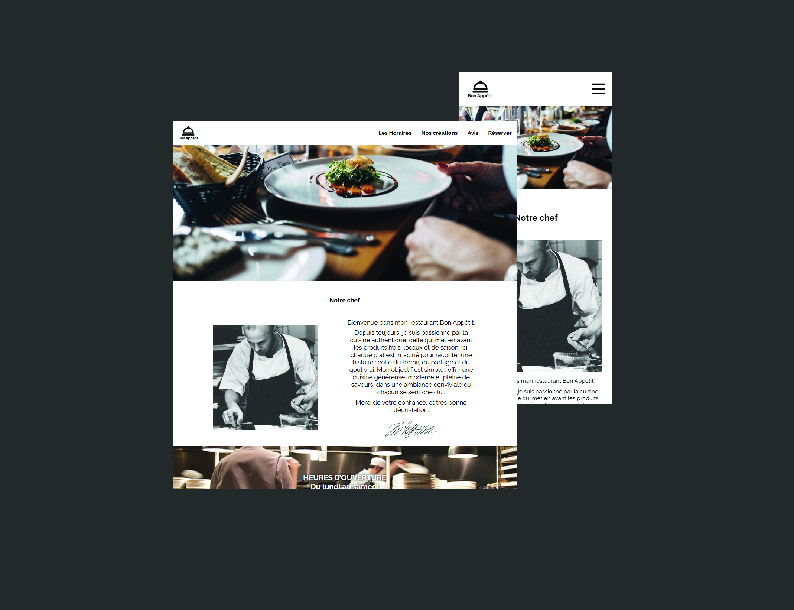

# Restaurant "Bon Appétit" - Intégration Web

Ce projet consiste en la création d'un site vitrine moderne et attractif pour le restaurant "Bon Appétit", dirigé par Monsieur Michel Bouillon. L'objectif est de digitaliser l'établissement pour permettre aux clients de découvrir la carte et de réserver en ligne.

## Fonctionnalités

Format One Page : Navigation fluide sur une seule page pour un accès rapide à l'information.

Système de Réservation : Formulaire dynamique permettant de saisir le nom, l'heure et le nombre de couverts.

Vitrine Gastronomique : Section carte présentant les plats avec photos, noms et descriptions, accompagnée d'une galerie des réalisations du chef.

Preuve Sociale : Section dédiée aux trois derniers témoignages clients pour renforcer la confiance et l'image de marque.

Informations Pratiques : Pied de page regroupant les horaires, l'adresse, les contacts réseaux sociaux et les mentions légales.

## Stack Technique

Langages : HTML5 / CSS3.

Gestion de version : Workflow Git / GitHub.

Déploiement : GitHub Pages.

## Structure du Code

Conformément aux spécifications:

Header : Barre de navigation ancrée vers les sections.

Main Content : Sections Carte, Galerie, Réservation et Témoignages.

Footer : Coordonnées et informations de contact.

## Aperçu des Tests

Workflow : Collaboration impérative via Git.

Contenus : Utilisation des photos fournies par le client et rédaction des contenus textuels par l'intégrateur.

[Bon appetit](https://bonappetit-corentin-baptiste.github.io/Projet-Michel-Bouillon/)
